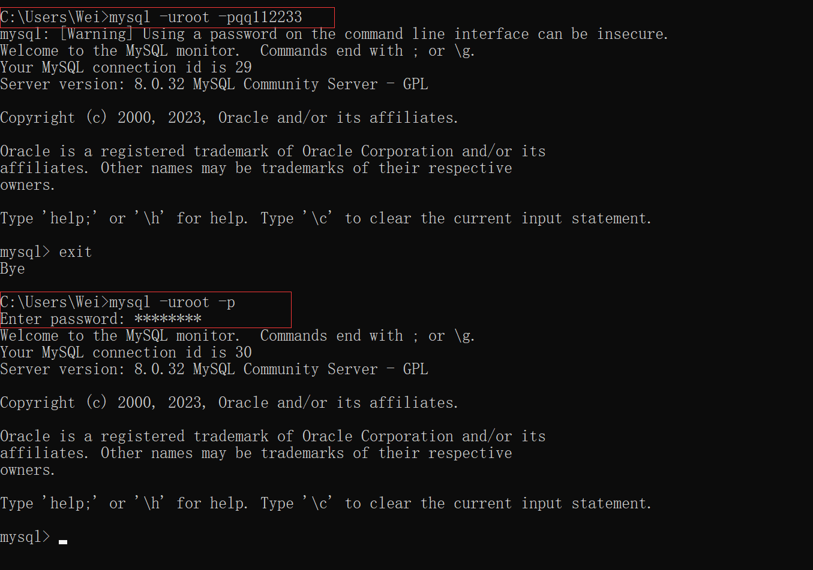

# 01MySQL基本命令

---

## Other

*   查看当前版本
    *   `mysql --version`

*   登录mysql
    *   `mysql -uroot -p<密码>`
    *   输入完-p后回车将在下一行以密码显示方式输入密码
    *   

*   退出mysql
    *   `exit`
*   查看所有数据库
    *   `show databases;`
*   创建数据库
    *   `create database <表名>;`
*   查看数据库中的表
    *   `show tables;`

*   导入表
    *   `scource <path\file>;`
    *   路径中不能含义中文、
*   查看表结构
    *   `desc <表名>;`
*   查看当前使用的数据库
    *   `select database();`
    *   select * from empy where sal between 1250 and 3000 order by sal desc;

---

## DQL Select

*   `select <[字段名1 [as 别名1][,...]] | *> from <表名> [where <条件>] [order by <字段表达式> [desc|asc][, ...]] [group by <分组依据>] [having <条件>]`
*   特殊的条件表达式
    *   `between <val1> and <val2>`
        *   [val1, val2]
    *   `is null 和 is not null`
        *   `A == null `是不合法的  必须要用 `A is null`
    *   `not` 
        *   取反
    *   `in`
    *   `like`
        *   % : 匹配任意个字符
        *   _ ： 匹配一个字符
*   **执行顺序**
    1.   from
    2.   where
    3.   group by
    4.   select
    5.   order by

---

## 单行处理函数

*   `lower(s)、 upeer(s)`
    *   大小写转换
*   `substr(s, 起始长度, 截取长度)`
    *   下标是从1开始的
*   `concat(s1, s2)`
    *   字符串拼接
*   `trim(s)`
    *   取出前后导空格
*   `str_to_date(s)`
    *   见名知意
*   `round(n,m)`
    *   四舍五入
    *   同VF
*   `ifnull(val, 替换值)`
    *   只要数学运算中出现了null那么结果就是null，可以使用ifnull()来过滤
    *   val为空时当做替换值处理 
*   `(case 表达式 when <值1> then <输出值1>[,...] else <默认值> end)`
    *   根据不同表达式的值输出不同的值

## 多行处理函数

*   使用之前必须分组，如果没有分组，则默认所有记录为一组
*   以 下函数处理时自动忽略null
*   `count()`
    *   `count(*)`统计表中有多少条记录
    *   `count(字段)`统计该字段下的非空记录数量
*   `sum()`
*   `avg()`
*   `max()`
*   `min()`
*   **在where中不能使用分组函数；因为where在group by 之前执行；在group在select之前，所以可以在select中使用**
*   为了解决以上情况可以使用`having <条件>`;having是在分组后对数据进行过滤
*   一般能用where使用where如果实在无法完成分组效果再用having
*   分组之后select中最好不要加除分组函数和分组字段外的其他字段
